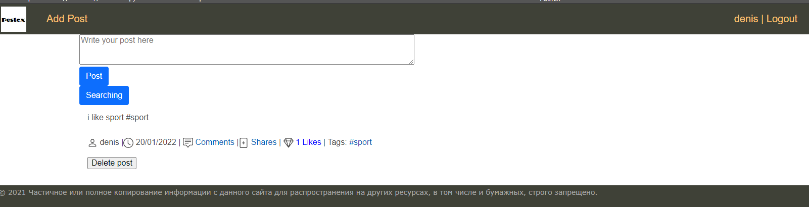
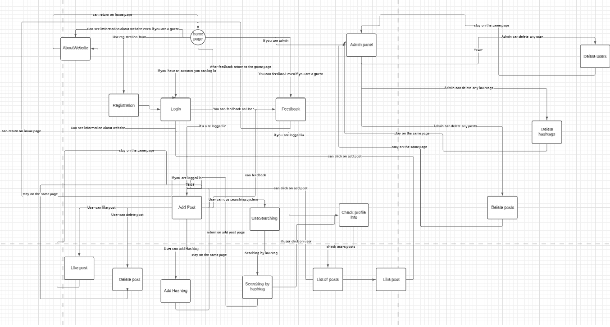

# User Interface Design
## List of interfaces
- **Page of login**  
Login and password form, remember form, the ability to recover the password
- **Page of registration**  
Registration form with required fields of login and password mail
- **Page of Feedback**  
Form for feedback (login mail and the text itself)
- **Page about website**  
Site description page
- **Page of making and deleting posts**  
If the user is authorized, then a page is available on which he can write a post (add a hashtag to it), a button to search for other posts
- **Page of searching posts by hashtags**  
The field for entering keywords, if the desired post is not found, it will display that there is no such post
- **Page of searching posts**  
Separate page for searching words in posts
- **Home page**   
The home page of the site, from which you can use adding a post, viewing information about the site and sending feedback
- **Login admin page**
Login for admins
- **Admin page**  
Where admins can delete/make users/posts
- **Profile page**
- Info about user
## Interface sketches

-----------------------------------
 
-----------------------------------
  
-----------------------------------

-----------------------------------

-----------------------------------

-----------------------------------

-----------------------------------

-----------------------------------

-----------------------------------

-----------------------------------

## Interface diagram
  