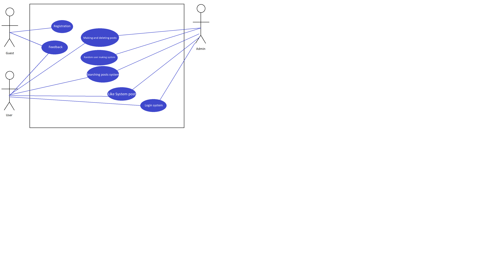

# Use Case

## List of actors
Guest:
* See the information about website
* Register an account   

User:
* Edit your own information
* Make posts
* Search posts by hashtag
* Can add hashtags for posts
* Like or dislike the searched post
* Do what guests can do  

Administrator:
* Set and unset users as ADMIN
* Delete users
* Create random users
* Do what users and guests can do

## Description of Use Cases

|        Name       | Description |
| :----------------:| :----: |
| Login Use Cases      | Provide users with the function of website login |
| Register Use Cases   | Provide users with the function of website registration | 
| Management Use Cases | Provide users and administrators with the function of managing accounts respectively |
| Searching Use Cases  | The main business of the website, sorting and searching posts by hashtags |
| Like Dislike Use Cases  | Click to rate whether you like post |
| Random user Use Cases  | For Administrator to create test users |

## BOM Portal Use Cases
|        *Use Cases*       | Login  |
| :----------------:| :----: |
| Brief Description | For user to login to the website |
| Primary Actor     | User and administrators | 
| Preconditions     | User has registered in the website |
| Basic Path        | The user enters the user name and password, and clicks the login button |
| Alternative Path  | The user forgets his password, click forgot password, jump to the password modification page, enter your personal information, and enter a new password, click modify password |
| Postconditions    | If the login is successful, it will jump to the homepage, if the login fails or the password modification is successful, it will jump to the login page, if the password modification fails, it will return to the password modification page. |

|        *Use Cases*       | Register |
| :----------------:| :----: |
| Brief Description | For users to register on the site |
| Primary Actor     | guest | 
| Preconditions     |  |
| Basic Path        | Enter basic information such as username and password and information about yourself, and click the register button |
| Alternative Path  | If the user enters the wrong data, it will be prompted to correct the data  |
| Postconditions    | If the registration is successful, it will jump to the login page, if the user name already exists, it will jump back to the registration page |

|        *Use Cases*       | Management |
| :----------------:| :----: |
| Brief Description | Let users and administrators manage their accounts |
| Primary Actor     | User and administrator | 
| Preconditions     | Already login |
| Basic Path        | The user or administrator edits their personal information, make posts and searching them |
| Alternative Path  | The administrator can enter the specified user name, set his role as administrator or user, and the administrator can delete the specified user |
| Postconditions    | After setting success or failure, return to the management page |

|        *Use Cases*       | Searching |
| :----------------:| :----: |
| Brief Description | Users looking for interesting posts |
| Primary Actor     | User and administrator | 
| Preconditions     | Already login |
| Basic Path        | The user write main words |
| Alternative Path  | If such post doesnt exist it will write about it |
| Postconditions    | The system returns the matched posts |

|        *Use Cases*       | Like Dislike |
| :----------------:| :----: |
| Brief Description | Like or dislike for the post |
| Primary Actor     | User and administrator | 
| Preconditions     | Already login |
| Basic Path        | Search post and click like if you like it |
| Postconditions  | - |

|        *Use Cases*       | Random user |
| :----------------:| :----: |
| Brief Description | Generate random users |
| Primary Actor     | Administrator | 
| Preconditions     | Administrator logged in |
| Basic Path        | Click the button to generate random users on admin page |
| Postconditions    | Random user generation, provided to the administrator for testing |

## Use Cases Image
  